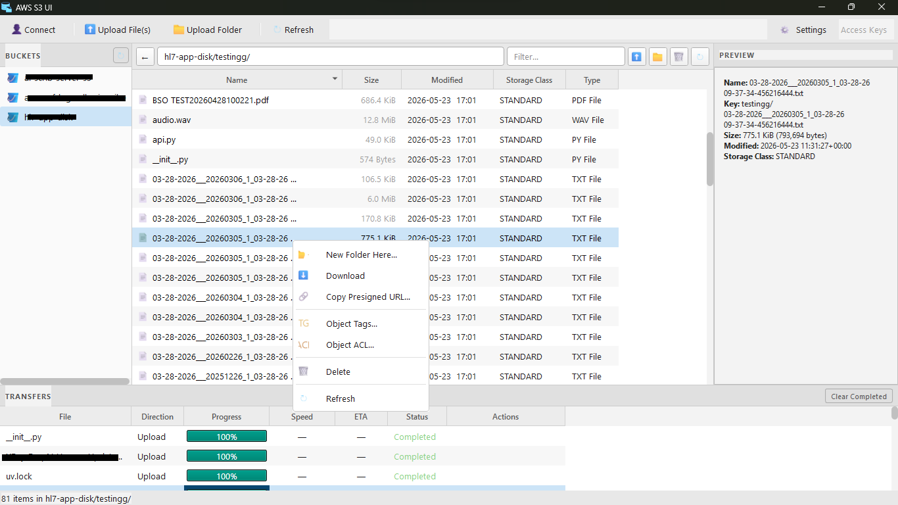

# nss3ui



`nss3ui` is a desktop GUI for browsing and transferring files in Amazon S3 (and S3-compatible storage).

## What the GUI does

- Connects to S3 using either:
  - AWS profile from your local AWS config
  - Access key / secret key (optional session token)
- Lists buckets and lets you open a bucket
- Browses folders/objects inside a bucket
- Multi threaded upload/download operations so GUI don't freeze.
- Uploads files to a selected bucket path
- Downloads selected objects to local disk
- Downloads a whole S3 folder as a ZIP file.
- Auto MIME type detection and applied at upload time.
- Create a folder.
- Rename/Move a folder
- Copy presigned URLs of files with custom expires in value.
- Add tags/Acls to objects.
- Drag drop files and folders to upload.
- Shows transfer queue/progress and status updates
- Overall download/upload progress at bottom right
- Previews selected objects (where supported)
- Supports dark/light theme switching from Settings

## Typical workflow

1. Click **Connect** and choose profile or access keys.
2. Select a bucket from the left panel.
3. Browse objects in the center panel.
4. Use **Upload**, **Download**, or refresh as needed.
5. Watch transfer progress in the transfer panel at the bottom.

## Run locally

### Option 1: with uv

```bash
uv sync
uv run nss3ui
```

### Option 2: with pip

```bash
pip install -e .
nss3ui
```

## Requirements

- Python 3.11+
- AWS credentials with S3 permissions

---

<a href="https://iconscout.com/icons/file-storage" class="text-underline font-size-sm" target="_blank">File Storage</a> by <a href="https://iconscout.com/contributors/arga-muria" class="text-underline font-size-sm">Krisna Arga Muria</a> on <a href="https://iconscout.com" class="text-underline font-size-sm">IconScout</a>
